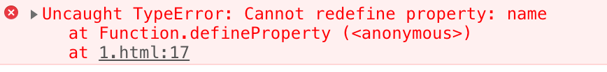

# 面向对象的程序设计

## 理解对象

创建自定义对象最简单方式就是创建一个`Object`的实例，然后再为它添加属性和方法，如下所示：

```javascript
var person = new Object();
person.name = "Nicholas";
person.age = 29;
person.job = "Software Engineer";
person.sayName = function() {
    alert(this.name);
};
```

使用对象字面量语法定义

```javascript
var person = {
    name:"Nicholas",
    age:29,
    job:"Software Engineer",
    sayName: function () {
        alert(this.name);
    }
}
```

### 属性类型

ECMAScript中有两种属性：**数据属性**和**访问器属性**;

#### 1.数据属性

数据属性包含一个数据值的位置。在这个位置可以读取和写入值。数据属性有4个描述其行为的特性。

* Configurable
* Enumerable
* Writable
* Writable

要修改属性默认的特性，必须使用ECMAScript5的`Object.defineProperty()`方法。这个方法接收三个参数：属性所在的对象、属性的名字和一个描述符对象。

```javascript
var person = {};
Object.defineProperty(person,"name",{
	writable:false,
	value:"Nicholas"
});
console.log(person.name); //Nicholas
person.name = "Greg";
console.log(person.name); //Nicholas
```

把`configurable`设置为false，表示不能从对象中删除属性。如果对这个属性调用delete，则在非严格模式下什么也不会发生，而在严格模式下会导致错误。而且，一旦把属性定义为不可配置的，就不能再把它变回可配置了。此时，再调用`Object.defineProperty()`方法修改除writable之外的特性，都会导致错误。

```text
var person = {};
Object.defineProperty(person,"name",{
	configurable:false,
	value:"Nicholas"
});
console.log(person.name); //Nicholas
person.name = "Greg";
console.log(person.name); //Nicholas
//抛出错误
Object.defineProperty(person, "name",{
	configurable:true,
	value:"Nicholas"
});
```



#### 2.访问器属性

### 定义多个属性

### 读取属性的特性

### 合并对象

## 6.2 创建对象

### 5.2.1 工厂模式

### 5.2.2 构造函数模式

```javascript
function Person (name,age,job){
    this.name = name;
    this.age = age;
    this.job = job;
    this.sayName = function(){
        alert(this.name);
    };
}

var person = new Person("Nicholas",29,"Software Engineer");
```

#### 1. 将构造函数当做函数

```javascript
function Person(name, age, job) {
    this.name = name;
    this.age = age;
    this.job = job;
    this.sayName = function() {
        alert(this.name)
    };
}
//当做构造函数使用
var person = new Person("Nicholas", 29, "Software Engineer");
person.sayName(); //Nicholas
// 作为普通函数调用

//当在全局作用域中调用一个函数时，Person方法中的this对象总是指向Global对象
//在浏览器中就是window对象 
Person("Greg", 27, "Doctor");
window.sayName(); //Greg

//在另外一个对象的作用域中调用
var o = new Object();
Person.call(o,"Kristen",25,"Nurse");
o.sayName(); //Kristen
```

#### 2.构造函数的问题

###  6.2.3 原型模式

使用原型对象的好处是可以让所有对象实例共享它们所包含的属性和方法。

```javascript
function Person(){

}
Person.prototype.name = "Nicholas";
Person.prototype.age = 29;
Person.prototype.job = "Software Engineer";
Person.prototype.sayName = function(){
    alert(this.name);
};
var p1 = new Person();
p1.sayName(); //Nicholas
var p2 = new Person();
p2.sayName(); // Nicholas

alert(p1.sayName == p2.sayName);// true
```

#### 1.理解原型对象

创建了自定义的构造函数之后，其原型对象默认只会取得constructor属性。当调用构造函数创建一个新实例后，该实例内部将包含一个指针，指向构造函数的原型对象。这个指针叫\[\[Prototype\]\]。

#### 2.原型与in操作符

#### 3.更简单的原型语法

#### 4.原型的动态性

#### 5.原生对象的原型

#### 6.原型对象的问题

## 6.3 继承

### 6.3.1 原型链

### 6.3.2 借用构造函数

### 6.3.3 组合继承

### 6.3.4 原型式继承

### 

